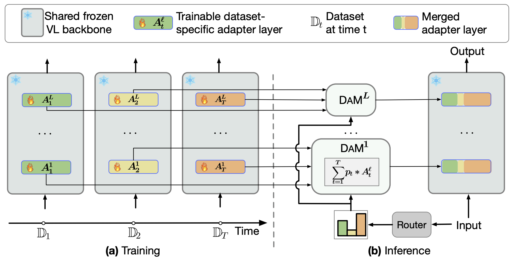

# DAM: Dynamic Adapter Merging for Continual Video QA Learning

[Paper](https://arxiv.org/abs/2403.08755)



We present a parameter-efficient method for continual video question-answering (**VidQA**) learning. Our method, named **DAM**, uses the proposed Dynamic Adapter Merging to (i) mitigate catastrophic forgetting, (ii) enable efficient adaptation to continually arriving datasets, (iii) handle inputs from unknown datasets during inference, and (iv) enable knowledge sharing across similar dataset domains.

Our DAM model outperforms prior state-of-the-art continual learning approaches by 9.1% while exhibiting 1.9% less forgetting on 6 VidQA datasets spanning various domains. We further extend DAM to **continual image classification** and **image QA** and outperform prior methods by a large margin.

---

Table of Contents

* [DAM: Dynamic Adapter Merging for Continual Video QA Learning](#dam-dynamic-adapter-merging-for-continual-video-qa-learning)
   * [Video Question Answering](#video-question-answering)
      * [Setup](#setup)
      * [Quick Start](#quick-start)
         * [Set Environmental Variables](#set-environmental-variables)
         * [Download processed data and pretrained checkpoints](#download-processed-data-and-pretrained-checkpoints)
         * [Train and Inference](#train-and-inference)
   * [Acknowledgements](#acknowledgements)
   * [Citation](#citation)

---

## Video Question Answering

### Setup

To install requirements, run:

```bash
conda create -n dam python=3.8
conda activate dam
conda install pytorch==1.8.1 torchvision==0.9.1 cudatoolkit=11.1 -c pytorch -c nvidia
pip install -r requirements.txt
```

### Quick Start

#### Set Environmental Variables

We put our training data in directory `$CVL_DATA_DIR` and experiment logs (checkpoints, intermediate results etc.) in `$CVL_EXP_DIR`.

Add the following lines to your `.bashrc`. **Be sure to modify them with your actual paths.**

```bash
# in the root dir of our code
export PYTHONPATH=`pwd`:$PYTHONPATH

# replace with real paths.
export CVL_DATA_DIR=/path/to/save/your/downloaded/dataset
export CVL_EXP_DIR=/path/to/save/your/experiment/logs
```

#### Download processed data and pretrained checkpoints

- **Datasets**. You can download them on the [GoogleDrive](https://drive.google.com/drive/folders/1ED2VcFSxRW9aFIP2WdGDgLddNTyEVrE5?usp=sharing). They are processed by FrozenBiLM. Read more instructions from [their repo](https://github.com/antoyang/FrozenBiLM).
- **Pretrained checkpoint**. Download on the [GoogleDrive](https://drive.google.com/file/d/1-_mUTxSjQj-NZ-le0-mDUftaikB_2nsU/view?usp=sharing). It's pretrained on WebVid10M by FrozenBiLM. We initialize our model with this checkpoint when finetuning on downstream datasets.

**Be sure to put the data and checkpoint in the correct places. Specifically,**

- The datasets data should be put in `$CVL_DATA_DIR/frozen_bilm/data`.
- The path of pretrained checkpoint should be `$CVL_DATA_DIR/frozen_bilm/checkpoints/frozenbilm.pth`.

#### Train and Inference

Our method contains 4 steps:

1. **Continual Finetuning**: We continually finetuning on the sequentially arriving datasets. At each time step, we train the model on 4 A5000 (24GB) GPUs with a batch-size of 8. You can adjust accordingly and the results should be similar.
2. **Extract Embeddings**: We extract the embeddings for each dataset on both training and testing set. This step can be done in-parallel with Step 1.
3. **Router Prediction**: We predict the dataset identity probability for each test sample. This step is a super fast (i.e. a few seconds).
4. **Inference and Evaluation:** We evaluate our method on all the datasets and obtain the VidQA accuracies.

The entire training and inference takes about **1 day**. You can speedup this process by (i) parallel step 1 and step 2, (ii) parallel the inference on each dataset in step 4.

Here is the script:

```bash
ngpus=4 # train the model on 4GPUs.
expname="dam/vidqa-1.0"
datasets="ivqa msvd msrvtt lsmdc activitynet tgif"
args=" " # additional arguments passed to model training script.
ckptdir=$CVL_EXP_DIR/frozen_bilm/${expname}/train
embedding_dir=$CVL_EXP_DIR/frozen_bilm/${expname}/embeddings
logits_dir=$CVL_EXP_DIR/frozen_bilm/${expname}/routers
eval_res_dir=$CVL_EXP_DIR/frozen_bilm/${expname}/evaluate

# step 1: continual finetuning on each dataset
bash dam/scripts/train.sh $ckptdir $ngpus "$datasets" "$args"

# step 2: extract embeddings for each dataset
bash dam/scripts/obtain_embeddings.sh "$datasets" $embedding_dir

# step 3: predict dataset identity for each sample in each dataset
python dam/router_cls.py --embedding_dir  $embedding_dir --save_dir $logits_dir

# step 4: inference and evaluation
eval_args="--router_temp 0.01 --topk 2"
bash dam/scripts/evaluate.sh $ckptdir $eval_res_dir $logits_dir "${eval_args}"
tail $eval_res_dir/*ry.json # print accuracies for all datasets
```


## Acknowledgements
For VideoQA, we apply our method on the [FrozenBiLM](https://github.com/antoyang/FrozenBiLM). Many Thanks!

## Citation

If you found this work useful, consider giving this repository a star and citing our paper as followed:

```
@article{cheng2024dam,
  title={DAM: Dynamic Adapter Merging for Continual Video QA Learning},
  author={Cheng, Feng and Wang, Ziyang and Sung, Yi-Lin and Lin, Yan-Bo and Bansal, Mohit and Bertasius, Gedas},
  journal={arXiv preprint arXiv:2403.08755},
  year={2024}
}
```
